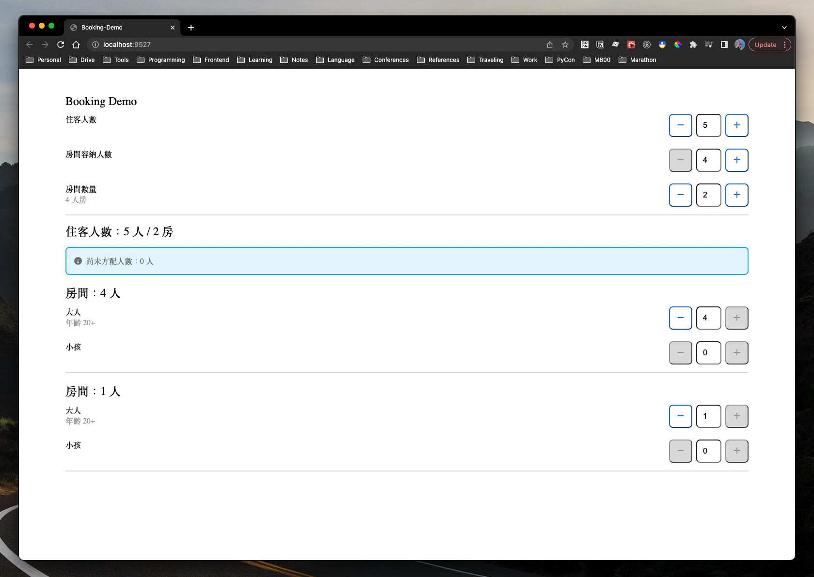
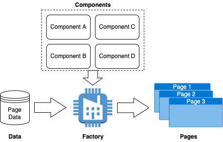

# Booking Demo in React



This repository is a simple demo for implementing booking function in React 17. 🚀

> HINT: If you have any questions, please feel free to ask me.

---

## Description

### Execution

1. To run this demo, you need to clone the project first.
  ```bash
  $ git clone https://github.com/yungshenglu/Booking-Demo
  ```
2. After cloning, change the your current directory into the repository and setup the project
   ```bash
   $ cd Booking-Demo/ & yarn install
   ```
   - The command `yarn install` will install some necessary packages for this project
   - It will take few second for running above command
3. Compiles and hot-reloads for development
   ```bash
   $ yarn start
   ```
   - It will take few second for running above command
   - You won't get any error messages if running successful
4. Congratulation! you can open your browser to `http://localhost:9527` and see our Booking-Demo

---

## Implementation

### Components

- All components are implemented without any third-party UI library.
- The styles of components are implemented with [Emotion](https://emotion.sh/docs/introduction) which is a library designed for writing css styles with JavaScript. In short, it is an styled-component design.

### Long-Press Function in Button

- The long-press function is implemented via `setInterval` to detect whether the action of clicking button in long-press in `CustomButton`.
  - You can adjust the interval of long-press arbitrary.
- To implement long-press action, we also need these **synthetic events** as follow in React:
  - `onMouseDown`
  - `onMouseUp`
  - `onMouseLeave`
  - `onTouchStart`
  - `onTouchEnd`

### Factory Design



- Data: `/src/constants/RoomFormInfo.js`
- Components: `/src/components/`
- Factory: `/src/containers/FormFactory.js`

---

## Contributor

> NOTICE: You can follow the contributing process [CONTRIBUTING.md](CONTRIBUTING.md) to join me. I am very welcome for any issue!

- [David Lu](https://github.com/yungshenglu)

---

## License

[WTFPL](LICENSE)
